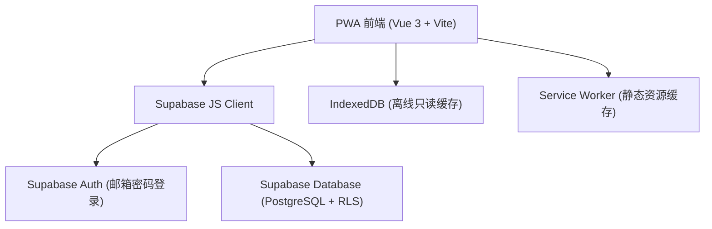
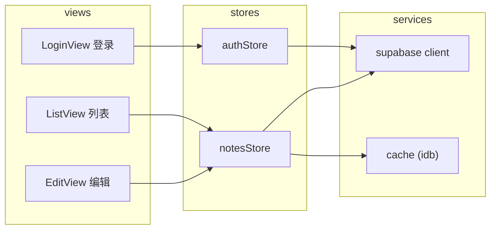

# Personal Memo 技术设计

Feature Name: personal-memo
Updated: 2026-09-05

## Description

个人备忘录 PWA 应用：纯文本笔记的创建、编辑、删除、搜索、置顶与颜色标记，数据存于 Supabase 云端，支持多设备同步与离线只读查看，可安装到手机桌面。

## Architecture



技术栈：

| 层 | 选型 | 理由 |
|----|------|------|
| 前端框架 | Vue 3 + Vite + `<script setup>` | 轻量、生态成熟、开发效率高 |
| 状态管理 | Pinia | Vue 3 官方推荐 |
| 路由 | Vue Router | 登录页/列表页/编辑页三路由 |
| UI | 自定义 CSS（移动优先） | 备忘录界面简单，避免引入重型组件库 |
| 云后端 | Supabase（Auth + Postgres） | 免费额度充足，认证与数据库一体化 |
| 离线缓存 | IndexedDB（idb 库） | 结构化存储笔记缓存 |
| PWA | vite-plugin-pwa | 自动生成 manifest 与 Service Worker |
| 部署 | Cloudflare Pages | 免费托管、自动 HTTPS、构建部署一体化 |

## Components and Interfaces



- **LoginView**: 登录/注册表单，邮箱 + 密码
- **ListView**: 搜索框 + 置顶分组 + 笔记卡片流 + 新建悬浮按钮
- **EditView**: 标题（可选）、正文、置顶开关、颜色选择（6 色）、保存/删除
- **authStore**: 会话管理、登录注册、退出
- **notesStore**: 笔记 CRUD、搜索过滤、与云端/缓存双向同步
- **cache 模块**: 登录后全量缓存笔记到 IndexedDB，离线时读取

## Data Models

PostgreSQL 表 `notes`：

| 字段 | 类型 | 说明 |
|------|------|------|
| id | uuid | 主键，默认 gen_random_uuid() |
| user_id | uuid | 所属用户，外键 auth.users(id) |
| title | text | 标题，可为空 |
| content | text | 正文（必填） |
| pinned | boolean | 置顶标记，默认 false |
| color | text | 颜色标记，取值 default/red/orange/yellow/green/blue |
| created_at | timestamptz | 创建时间，默认 now() |
| updated_at | timestamptz | 更新时间，触发器自动维护 |

TypeScript 类型：

```ts
interface Note {
  id: string
  user_id: string
  title: string | null
  content: string
  pinned: boolean
  color: 'default' | 'red' | 'orange' | 'yellow' | 'green' | 'blue'
  created_at: string
  updated_at: string
}
```

RLS 策略：`authenticated` 用户仅能对 `user_id = auth.uid()` 的行执行 SELECT/INSERT/UPDATE/DELETE。

## Correctness Properties

1. 列表排序恒定：置顶笔记在前，组内按 updated_at 倒序
2. 数据归属恒定：任何请求上下文中，读写范围限于当前登录用户的笔记
3. 缓存一致性：联网状态下列表数据以云端为准，每次成功拉取后覆盖本地缓存
4. 列表标题展示规则：title 非空显示 title，否则取 content 首行
5. 空笔记不落库：title 与 content 均为空时禁止创建

## Error Handling

| 场景 | 处理 |
|------|------|
| 登录凭据错误 | 表单下方显示"邮箱或密码错误" |
| 注册邮箱已存在 | 提示"该邮箱已注册，请直接登录" |
| 网络请求失败（读） | 显示错误提示条，若存在本地缓存则回退展示缓存数据 |
| 网络请求失败（写） | 编辑界面保留输入内容，提示保存失败可重试 |
| 离线时新建/编辑 | 提示"当前离线，恢复网络后操作" |
| 会话过期 | 自动跳转登录页 |

## Test Strategy

- 单元测试（Vitest）：排序逻辑、搜索过滤、标题展示规则、颜色取值校验
- 组件测试：登录表单校验、编辑保存/删除流程
- 手动验收：部署后按 requirements.md 逐条验证 EARS 验收标准

## References

[^1]: (Website) - [Supabase JS v2 文档](https://supabase.com/docs/reference/javascript/introduction)
[^2]: (Website) - [vite-plugin-pwa 文档](https://vite-pwa-org.netlify.app/)
[^3]: (Website) - [Cloudflare Pages 部署 Vite](https://developers.cloudflare.com/pages/framework-guides/deploy-a-vite-3-project/)
[^4]: (Filename) - `.monkeycode/specs/personal-memo/requirements.md`
